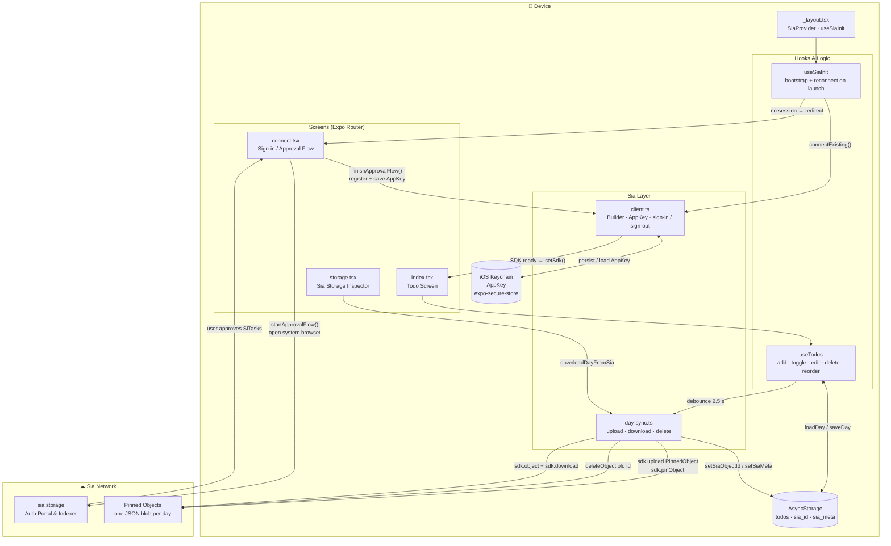

<div align="center">

# SiTasks

**Your todos, stored on the decentralized web.**

A privacy-first iOS todo app built with React Native and Expo.  
No server. No account data sold. Your tasks live on [Sia](https://sia.tech) — and only you own them.

[](LICENSE)
[](https://developer.apple.com)
[](https://expo.dev)
[](https://reactnative.dev)
[](https://www.typescriptlang.org)

</div>

---

## Demo

▶️ **[Watch the demo video](https://youtube.com/shorts/NIJKk8MiWno?feature=share)**

---

## What is SiTasks?

SiTasks is an open-source iOS todo app that uses [Sia decentralized storage](https://sia.tech) as its backend. There is no server in the middle — every task you create is serialized to JSON and uploaded directly to the Sia network as an immutable pinned object. The app keeps a local copy in AsyncStorage for instant reads and syncs to Sia automatically in the background with a 2.5-second debounce after each change.

- **Decentralized** — your data is stored on Sia, not a company's database
- **Private** — no user account data, no analytics, no telemetry
- **Offline-capable** — AsyncStorage is the source of truth for reads; Sia is the durable backup
- **Day-based** — each calendar day is its own Sia object, making individual days independently verifiable and auditable

---

## Features

- 📅 Date-based task list with arrow navigation and a full calendar picker
- 🔴 Four priority levels (none / low / medium / high) shown as color-coded dots
- ✏️ Inline task editing, toggle complete, delete, and clear completed
- 📊 Progress bar showing completed vs. total tasks for the day
- ☁️ Live sync status badge — Syncing / Synced / Error
- 🔍 Sia Storage inspector screen — browse every synced day, its object ID, raw size, encoded size, sync timestamp, and live-fetch the raw JSON directly from Sia
- 🔐 Sign in with Sia via a browser-based approval flow (no password stored in the app)
- 🗝️ AppKey persisted in the iOS Keychain via `expo-secure-store`

---

## Architecture



### Project structure

```
sitasks/
├── app/                      # Expo Router screens
│   ├── _layout.tsx           # Root layout — SiaProvider, useSiaInit, Stack navigator
│   ├── index.tsx             # Main todo screen
│   ├── connect.tsx           # Sign-in / Sia approval flow
│   └── storage.tsx           # Sia storage inspector
└── src/
    ├── types/todo.ts         # Todo, DayData, Priority types
    ├── context/SiaContext.tsx # SDK state + React context provider
    ├── hooks/
    │   ├── useSia.ts         # App init — bootstrap and reconnect
    │   └── useTodos.ts       # CRUD operations + debounced Sia sync
    ├── sia/
    │   ├── client.ts         # Builder, AppKey helpers, sign-in / sign-out
    │   └── day-sync.ts       # Upload / download / delete one day's data
    ├── storage/todos.ts      # AsyncStorage wrappers for todos and Sia metadata
    ├── components/           # TodoItem, CalendarPicker, and more
    └── logger.ts             # Leveled logger (info / warn / error / debug)
```

---

## How Sia is Used

SiTasks integrates with the Sia decentralized storage network via [`react-native-sia`](https://github.com/SiaFoundation/react-native-sia). Below is exactly which Sia primitives the app uses and why.

### Authentication — `Builder` and `AppKey`

Authentication follows Sia's browser-based **approval flow**, similar in spirit to OAuth:

1. A `Builder` is constructed with the app's metadata and the `sia.storage` indexer URL.
2. `builder.requestConnection()` generates a one-time approval URL that is opened in the system browser via `Linking.openURL()`.
3. The user signs in with Google or email on `sia.storage` and grants SiTasks permission.
4. `builder.waitForApproval()` detects completion; `builder.register(phrase)` produces an **AppKey** — a scoped 32-byte credential that identifies this app–user pair without exposing the user's root wallet key.
5. The `AppKey` is serialized and stored in the **iOS Keychain** (`expo-secure-store`). On every subsequent launch `builder.connected(appKey)` reconnects silently without re-authorization.

Signing out deletes the `AppKey` from the Keychain. The local todos remain on-device.

### Storage — `PinnedObject`, upload, pin, download, delete

Each calendar day's todos are stored as a single JSON object on Sia's network:

| Operation | Sia API call | File |
|---|---|---|
| **Upload** new version | `sdk.upload(new PinnedObject(), reader, {})` | `day-sync.ts` |
| **Pin** so it persists | `sdk.pinObject(object)` | `day-sync.ts` |
| **Download** for verification | `sdk.object(id)` → `sdk.download(pinned, {})` | `day-sync.ts` |
| **Delete** old version | `sdk.deleteObject(id)` | `day-sync.ts` |

**Write path** (triggered every time a todo changes):

1. Save the change to AsyncStorage immediately — the UI never waits for the network.
2. Wait 2.5 seconds (debounce) to coalesce rapid edits into a single upload.
3. Upload the day's full JSON payload as a new `PinnedObject`.
4. Record the new object ID plus metadata (raw size, encoded size, timestamp) in AsyncStorage.
5. Delete the previous object from Sia to avoid accumulating stale versions.

**Read path** (the Storage inspector screen):

1. Load all known dates and their locally stored object IDs from AsyncStorage.
2. When the user taps **Fetch**, stream the object back from Sia using chunked `download.read()` calls, reassemble the buffer, and decode it as JSON for display.

### What gets stored on Sia

Every Sia object is a UTF-8 encoded JSON document with this shape:

```json
{
  "date": "2025-06-18",
  "syncedAt": 1750242000000,
  "todos": [
    {
      "id": "abc123",
      "text": "Review pull request",
      "completed": false,
      "priority": "high",
      "createdAt": 1750241900000
    }
  ]
}
```

No user identifiers, device info, or plaintext credentials are included. The object is only accessible to someone who holds the `AppKey`.

---

## Getting Started

### Prerequisites

| Tool | Version |
|---|---|
| Node.js | ≥ 18 |
| Xcode | ≥ 15 |
| CocoaPods | ≥ 1.15 |
| EAS CLI | latest |

You will also need a free **Sia account** at [sia.storage](https://sia.storage).

### Install dependencies

```bash
npm install
```

### Install iOS native dependencies

```bash
npx pod-install ios
```

### Run on a simulator

```bash
npm run ios
# or
npx expo run:ios
```

### Run on a physical device

SiTasks bundles `react-native-sia`, a native module that requires a custom dev client — **Expo Go will not work**.

```bash
# 1. Install EAS CLI if you haven't already
npm install -g eas-cli

# 2. Build and install a dev client on your connected device
npm run build:ios:dev

# 3. Start Metro
npx expo start --dev-client
```

### EAS cloud builds

```bash
# Ad-hoc / TestFlight preview
npm run build:ios:preview

# Production
eas build --platform ios --profile production
```

---

## Contributing

Issues and pull requests are welcome. Please open an issue first for any significant change so it can be discussed before implementation.

---

## License

MIT © 2026 SiTasks Contributors

See [LICENSE](LICENSE) for the full text.
